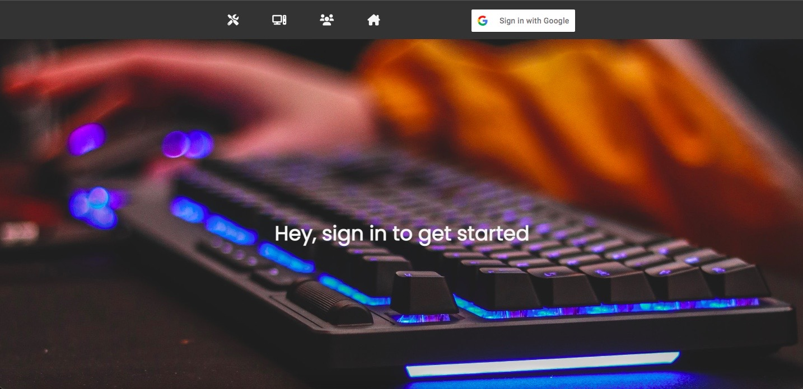

# <a href="https://pc-part-picker.herokuapp.com/">Deployed Link</a>
# <a href="https://trello.com/b/pLJ61zMh/pc-part-picker">Planning</a>

# **PC-Part-Picker**
## Users will be able to stub up a new PC through a series of options provided through dropdown text boxes. Users will then be able to interact with other users PC's and leave suggestions on the build.
---
---
# Current Features 
- Ability to create multiple PC builds
- Ability to see a list of current site users
- Ability to edit builds/delete builds
- Ability to leave reviews on other users' builds 
- Implementation of certain auth features that require a user to be logged in in order to do a number of things. These things are... 
  - Creating a PC,
  - Leaving a Review,
  - Editing a PC,
  - Deleting reviews that are tied to your profile ID,
  - Auth to prevent other users from deleteing anything not associated with their specific user ID.
---
# Technology Used
- Google Oauth
- Node.js
- Mongoose
- CSS
- JavaScript
- EJS
---
# Future Plans
- Implement ability to send builds to a friends list that will utilize the already implemented user "budget" feature.
  
- Implement a price feature that is unique to all PC parts and will add up all the individual prices and give the user an exact price for all the parts, this will play into the "budget" feature.
- Further improve styling.
---

